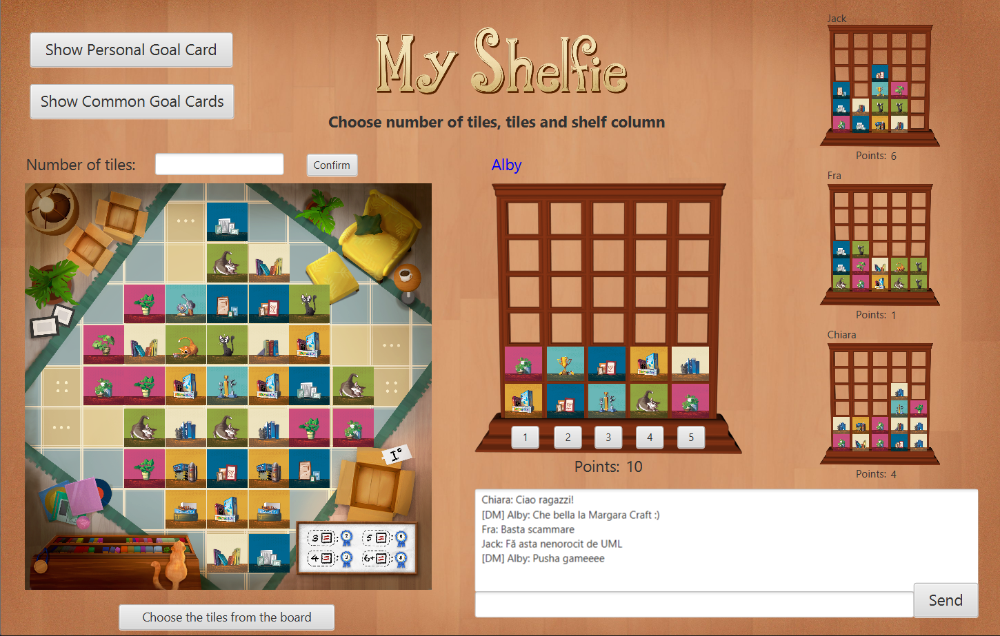
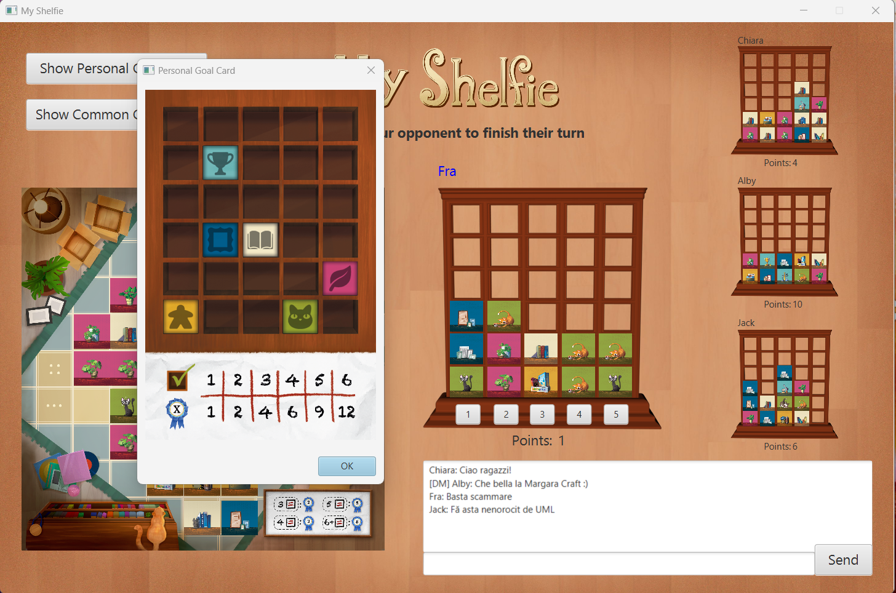
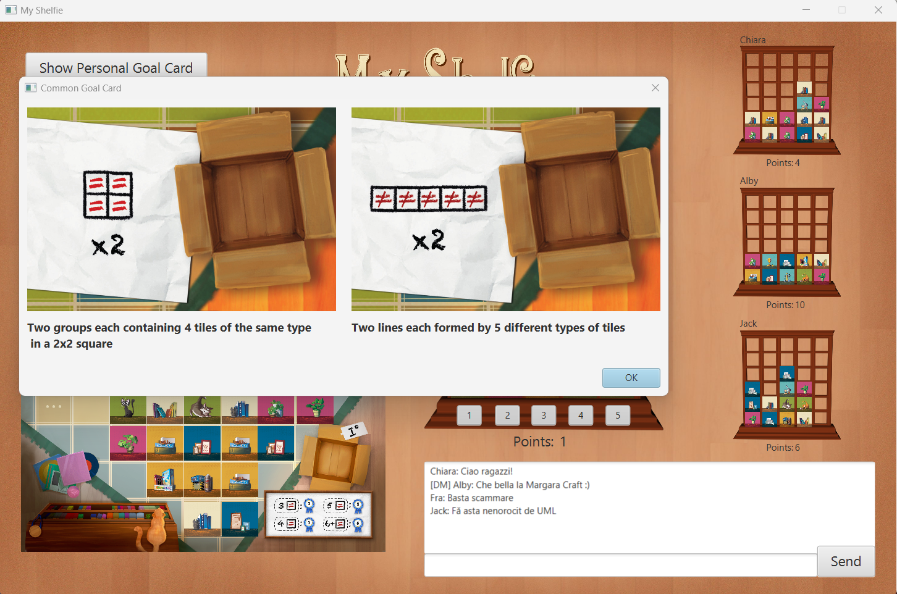

# Prova finale Ingegneria del Software 2023


## Gruppo AM04

- ####  Chiara Auriemma &nbsp;([@ChiaraAuriemma](https://github.com/ChiaraAuriemma))<br> 10722613&nbsp;&nbsp; chiara.auriemma@mail.polimi.it

- ####  Francesco Benelle &nbsp;([@Benels](https://github.com/Benels))<br> 10727489&nbsp;&nbsp; francesco.benelle@mail.polimi.it

- ####  Giacomo Ballabio &nbsp;([@Jackeeuu](https://github.com/jakeeuu))<br> 10769576&nbsp;&nbsp; giacomo2.ballabio@mail.polimi.it

- ####  Alberto Cavallotti &nbsp;([@Bertos1812](https://github.com/Bertos1812))<br>  10721275&nbsp;&nbsp; alberto1.cavallotti@mail.polimi.it

<br><br>
<br><br>
 
### About My Shelfie and the project's specifications
The goal of the project is to create a software version of the board game "My Shelfie" by Cranio Games.
The client-server application needs to fulfill all the rules of the classic board game.
<br><br>
Rulebooks: [ENG](src/main/resources/Rulebooks/MyShelfie_Ruleboo_ENG.pdf) or [ITA](src/main/resources/Rulebooks/MyShelfie_Rulebook_ITA.pdf) .
<br><br>

### Advanced Functionalities
##### Multiple Games
The Server can handle more than one game at the same time. Every player who decide to create a new game will be provided with a GameID to be shared to the friends he wants to play with.
<br><br>

##### Resilience to Disconnections
If one or more player from a game disconnect from the game, they have the opportunity to join again the same game and continue playing.
If the player doesn't reconnect in time for his turn, it will be skipped. If only one player is still connected to a certain game, a one-minute timer will start, then the win will be assigned to the only active player if nobody reconnected in time.
<br>
<br>
##### Chat
Every player can send chat messages to the other players in their game. A player may also send a private message to a specific player of the game.
<br>
<br>

### Implemented Functionalities

| Functionality  |                       State                        |
|:---------------|:--------------------------------------------------:|
| UML            | 🟢 |
| Model          | 🟢 |
| Controller     | 🟢 |
| Socket TCP     | 🟢 |
| RMI            | 🟢 |
| CLI            | 🟢 |
| GUI            | 🟢 |
| Multiple games | 🟢 |
| Chat           | 🟢 |
| Disconnection  | 🟢 |


#### Legend
🟢 Already implemented &nbsp;&nbsp;&nbsp;&nbsp;🟡 Currently work in progress&nbsp;&nbsp;&nbsp;&nbsp; 🔴  Currently not implemented

<br><br>
<br><br>

### Running The Game
The Game consists in a jar file named <code>AM04-1.0-SNAPSHOT-jar-with-dependencies</code> that can be started by command line. In order to start playing you'll need to start the Server and at least two Clients.
#### Server
```shell 
      > java -jar .\AM04-1.0-SNAPSHOT-jar-with-dependencies.jar server
```
The command above has to be used in order to start the Server and is the only command you will need until the Server needs to be shut down.
#### Client
```shell 
      > .\AM04-1.0-SNAPSHOT-jar-with-dependencies.jar client [Connection] [Interface] [ip address]
```
Connection: 
- tcp
- rmi

Interface:
- cli
- gui

ip address: 
- Play Online: set the ip to the server's. Use <code> ipconfig </code> in order to retrieve the ip address.
- Play Locally: you might not specify the ip address, so it will be set to the deault local ip (127.0.0.1)

The command above has to be used in order to start the Client. Later the player will be asked a nickname and whether he wants to create a new game or join an existing one.
The client can choose the communication protocol that he likes most between RMI and TCP.
The client can also choose the Interface .
<br><br>
<br><br>

#### GUI
<br>

<br>

<br>

<br><br>
<br><br>

#### CLI

